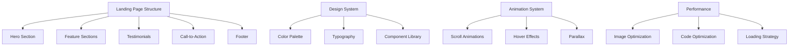

# System Patterns: Website Structure Guide

## Website Architecture

This template follows a modern, component-based architecture optimized for both visual appeal and performance:



## Website Sections & Purpose

### 1. Hero Section
The first screen visitors see, designed to make an immediate impression.

**Purpose**:
- Deliver a luxurious, artisan vibe within seconds  
- Communicate the signature scent or collection of the season  
- Encourage visitors to explore or shop immediately  
- Set a refined, magazine-style tone for the rest of the site  

**Recommended Elements**:
- Impact headline in a high-contrast black serif (6-12 words)  
- Subheadline describing craftsmanship and eco-friendly sourcing (1-2 sentences)  
- Primary CTA button: “Shop the Collection” in silver on black  
- Full-width still image or slow-motion candle-flame video with subtle fade-in  
- Optional: Line of press logos or review stars beneath CTA  

### 2. Feature Section
Highlights the key benefits and features of your product or service.

**Purpose**:
- Explain why hand-poured candles from @NoxBoutique are worth the investment  
- Address common pain points: chemical scents, short burn time, mass production  
- Visualize the small-batch pouring and premium wax blend  
- Reinforce the promise of a sophisticated home ambience  

**Recommended Elements**:
- 3-6 feature tiles with minimalist line icons (e.g., “Clean Burn,” “72-Hour Vessel,” “Sustainable Wick”)  
- One-sentence benefit per feature, max 12 words  
- Black text on white cards, silver accent lines for separation  
- Optional: Hover states that raise the card 4px and add a soft shadow  

### 3. Testimonials & Social Proof
Evidence that others trust and value your offering.

**Purpose**:
- Replace skepticism with peer validation  
- Show diverse lifestyle imagery using the candles  
- Highlight measurable outcomes: hours of burn, % repeat buyers  

**Recommended Elements**:
- Customer quotes with black-and-white profile photos  
- Short case snippets: “Used in 5-star hotels across NYC”  
- Instagram carousel embedding @NoxBoutique posts  
- Star ratings pulled from onsite reviews  

### 4. Call-to-Action Sections
Strategic conversion points throughout the page.

**Purpose**:
- Transition browsing into buying via timely prompts  
- Promote limited-edition scents and bundles  
- Keep visitor momentum with minimal friction  
- Reiterate free shipping threshold or gift-wrapping option  

**Recommended Elements**:
- Button copy such as “Add to Cart — $38”  
- Sub-headline: “Hand-poured today, delivered this week.”  
- 2-field email capture (name + email) for restock alerts  
- High-contrast silver border around the CTA block  

### 5. Footer
Information and navigation that supports the main content.

**Purpose**:
- Offer quick access to customer support and policy pages  
- Reinforce brand values of sustainability and craft  
- Provide alternate touchpoints for engagement and trust  
- Serve as the final, persistent CTA for newsletter sign-up  

**Recommended Elements**:
- Secondary nav: “Care Guide,” “Scent Finder Quiz,” “Sustainability,” “FAQ”  
- Contact information:  
  - Nox Boutique  
  - Customer Service Hours: Monday-Friday 9 am-6 pm EST  
  - Email: alla@nox.boutique  
  - Phone: (888) 555-0197  
  - Shipping Address: 456 Artisan Way, Suite 201, Brooklyn, NY 11201  
  - Social Media: @NoxBoutique  
- Copyright line: “© Nox Boutique. All rights reserved.”  
- Newsletter signup with placeholder “Enter email for 10% off first order”  

## Design System Principles

### Color System

This template uses a semantic color system that gives meaning to colors:

```
Primary    → Pure Black (#000000) for headlines & primary CTAs
Secondary  → Polished Silver (#BFBFBF) for borders, icons, secondary buttons
Accent     → Candle Flame Warmth (#F5E6D0) for hover highlights & alerts
Background → Soft White (#FFFFFF) for main canvas; #F8F8F8 for light section breaks
Text       → 90% Black for body, 60% Black for captions
```

When customizing colors based on competitor research:
1. Limit palette to black, silver, white, and one warm accent to maintain minimalism  
2. Produce 2 lighter tints and 2 darker shades of each for depth and accessibility  
3. Keep body backgrounds white to let product photography stand out  
4. Reserve warm accent for cart notifications and success states only  

### Typography System

The typography system uses a clear hierarchy:

```
Headings   → "Playfair Display", serif, letter-spacing 0.02em
Subheadings → "Playfair Display", semi-bold
Body       → "Inter", sans-serif, 1.6rem line-height
Caption    → "Inter", 0.85em, 60% black
```

When customizing typography:
1. Use Playfair Display at 48-64px for hero headings to evoke editorial luxury  
2. Body copy stays at 16-18px for effortless reading across articles and care guides  
3. Limit typefaces to the two families above to preserve load speed  
4. Establish scale: h1 3.5rem, h2 2rem, h3 1.5rem, body 1rem  

### Animation Guidelines

Animations should enhance content, not distract from it:

**Scroll Animations**:
- Elements fade + translate Y 20px into view over 0.45 s with ease-out  
- Delay 80 ms between staggered items for smooth rhythm  
- Disable heavy motion for users with “prefers-reduced-motion”  

**Hover States**:
- CTA buttons: background transitions from black to silver in 0.25 s  
- Product cards: image zoom 1.03× and warm accent underline appears  
- All transitions use cubic-bezier(0.4, 0, 0.2, 1)  

**Parallax Effects**:
- Subtle 5-10% depth shift on hero background only  
- Disabled below 1024 px to avoid performance hits  
- Never interfere with text legibility  

## Section Composition Patterns

### Hero Section Patterns

**1. Split Hero**
```
┌─────────────────┬─────────────────┐
│                 │                 │
│    Copy &       │     Image       │
│    CTA          │     or          │
│                 │     Video       │
│                 │                 │
└─────────────────┴─────────────────┘
```

**2. Centered Hero**
```
┌─────────────────────────────────┐
│                                 │
│         Headline                │
│       Subheadline               │
│          CTA                    │
│                                 │
│         Background              │
│                                 │
└─────────────────────────────────┘
```

**3. Full-width Hero with Overlay**
```
┌─────────────────────────────────┐
│                                 │
│    Copy & CTA                   │
│                                 │
│   (Overlay on full-width image) │
│                                 │
│                                 │
└─────────────────────────────────┘
```

### Feature Section Patterns

**1. Icon Grid**
```
┌───────┬───────┬───────┐
│ Icon  │ Icon  │ Icon  │
│ Title │ Title │ Title │
│ Text  │ Text  │ Text  │
└───────┴───────┴───────┘
```

**2. Alternating Sections**
```
┌─────────┬─────────┐
│ Image   │ Copy    │
└─────────┴─────────┘

┌─────────┬─────────┐
│ Copy    │ Image   │
└─────────┴─────────┘
```

**3. Feature Cards**
```
┌─────────┐ ┌─────────┐ ┌─────────┐
│         │ │         │ │         │
│  Card   │ │  Card   │ │  Card   │
│         │ │         │ │         │
└─────────┘ └─────────┘ └─────────┘
```

### Testimonial Section Patterns

**1. Testimonial Carousel**
```
┌─────────────────────────────────┐
│                                 │
│   ◀   Testimonial Quote     ▶   │
│        Person & Role            │
│          Company                │
│                                 │
└─────────────────────────────────┘
```

**2. Testimonial Grid**
```
┌─────────┐ ┌─────────┐
│ Quote   │ │ Quote   │
│ Person  │ │ Person  │
└─────────┘ └─────────┘
┌─────────┐ ┌─────────┐
│ Quote   │ │ Quote   │
│ Person  │ │ Person  │
└─────────┘ └─────────┘
```

**3. Featured Case Study**
```
┌─────────────────────────────────┐
│                                 │
│  Customer      Quote            │
│   Image                         │
│              Results            │
│                                 │
└─────────────────────────────────┘
```

## Responsive Design Principles

This template follows a mobile-first approach with these breakpoints:

```
Mobile:     < 640px
Tablet:     640px - 1024px
Desktop:    > 1024px
```

Key responsive principles:
1. Single-column layouts and swipeable product cards on mobile  
2. Collapsed floating nav into a minimalist hamburger with cart icon badge  
3. Tap targets ≥ 44×44 px for filter chips and quiz answers  
4. Reduced parallax and slower fade-ins on mobile to conserve battery  
5. Serve WebP images sized to viewport for each breakpoint  

## SEO & Performance Guidelines

**SEO Best Practices**:
- Use semantic HTML5 (header, nav, main, section, footer)  
- Alt text: “Hand-poured soy candle in black glass vessel” style descriptions  
- Hierarchical headings matching page outline and quiz flow  
- Title tags starting with scent name, then “| Nox Boutique”  
- 155-char meta descriptions that mention artisanal, hand-poured, Brooklyn  

**Performance Optimization**:
- Compress hero video to < 1 MB and lazy-load below-the-fold assets  
- Inline critical CSS; defer icon font loading  
- Eliminate layout shift by reserving image ratios in CSS  
- Preload top 6 product images for quick first interaction  
- Use system font stack fallback until web fonts are fully loaded  

By following these patterns, Nox Boutique will deliver a refined, high-performance shopping experience that embodies the intimate luxury of its handcrafted candles.
